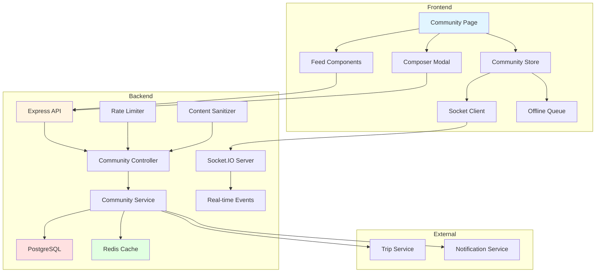

# Design Document: Community Threads Feed

## Overview

The Community Threads Feed is a mobile-first social feature that enables Journo users to share travel stories, embed trip itineraries, and engage in threaded conversations. The design follows a Threads-like minimalist aesthetic with infinite scrolling, real-time updates, and algorithmic content discovery.

The system consists of three main layers:
- **Backend API**: Node.js/Express with PostgreSQL for data persistence, Redis for caching, and Socket.IO for real-time updates
- **Frontend Client**: React/TypeScript with Zustand state management, optimistic updates, and offline support
- **Real-time Layer**: Socket.IO for live engagement updates, new posts, and community events

Key design principles:
- Mobile-first responsive design with desktop enhancements
- Optimistic UI updates for instant feedback
- Cursor-based pagination for infinite scroll
- Engagement-based algorithmic ranking
- Content sanitization and rate limiting for safety
- Accessibility compliance (WCAG 2.1 AA)

## Architecture

### System Components



### Data Flow

1. **Post Creation Flow**:
   - User submits post via Composer → Frontend validates → Optimistic update → API request
   - Backend sanitizes content → Rate limit check → Database insert → Cache invalidation
   - Socket.IO broadcasts new post → All connected clients receive update

2. **Feed Loading Flow**:
   - User requests feed → Check Redis cache → If miss, query database with engagement scoring
   - Apply cursor pagination → Cache results (2min TTL) → Return to client
   - Frontend renders with infinite scroll → Fetch next page on scroll

3. **Engagement Flow**:
   - User likes/reposts → Optimistic UI update → API request
   - Backend updates engagement counts → Recalculate engagement score → Invalidate cache
   - Socket.IO broadcasts updated counts → All viewers see live update

### Database Schema

```sql
-- Communities table
CREATE TABLE communities (
  id UUID PRIMARY KEY DEFAULT gen_random_uuid(),
  name VARCHAR(100) NOT NULL UNIQUE,
  description TEXT,
  icon_url VARCHAR(500),
  member_count INTEGER DEFAULT 0,
  post_count INTEGER DEFAULT 0,
  created_at TIMESTAMP DEFAULT NOW(),
  updated_at TIMESTAMP DEFAULT NOW()
);

-- Community members table
CREATE TABLE community_members (
  id UUID PRIMARY KEY DEFAULT gen_random_uuid(),
  community_id UUID NOT NULL REFERENCES communities(id) ON DELETE CASCADE,
  user_id UUID NOT NULL REFERENCES users(id) ON DELETE CASCADE,
  role VARCHAR(20) DEFAULT 'member', -- member, moderator, admin
  joined_at TIMESTAMP DEFAULT NOW(),
  UNIQUE(community_id, user_id)
);

-- Posts table (supports threading via parent_id)
CREATE TABLE posts (
  id UUID PRIMARY KEY DEFAULT gen_random_uuid(),
  user_id UUID NOT NULL REFERENCES users(id) ON DELETE CASCADE,
  community_id UUID REFERENCES communities(id) ON DELETE SET NULL,
  parent_id UUID REFERENCES posts(id) ON DELETE CASCADE,
  content TEXT NOT NULL CHECK (char_length(content) <= 500),
  trip_id UUID REFERENCES trips(id) ON DELETE SET NULL,
  media_urls JSONB DEFAULT '[]'::jsonb,
  tags TEXT[] DEFAULT ARRAY[]::TEXT[],
  like_count INTEGER DEFAULT 0,
  reply_count INTEGER DEFAULT 0,
  repost_count INTEGER DEFAULT 0,
  engagement_score DECIMAL(10,2) DEFAULT 0,
  is_deleted BOOLEAN DEFAULT FALSE,
  created_at TIMESTAMP DEFAULT NOW(),
  updated_at TIMESTAMP DEFAULT NOW()
);

-- Likes table
CREATE TABLE likes (
  id UUID PRIMARY KEY DEFAULT gen_random_uuid(),
  post_id UUID NOT NULL REFERENCES posts(id) ON DELETE CASCADE,
  user_id UUID NOT NULL REFERENCES users(id) ON DELETE CASCADE,
  created_at TIMESTAMP DEFAULT NOW(),
  UNIQUE(post_id, user_id)
);

-- Reposts table
CREATE TABLE reposts (
  id UUID PRIMARY KEY DEFAULT gen_random_uuid(),
  post_id UUID NOT NULL REFERENCES posts(id) ON DELETE CASCADE,
  user_id UUID NOT NULL REFERENCES users(id) ON DELETE CASCADE,
  created_at TIMESTAMP DEFAULT NOW(),
  UNIQUE(post_id, user_id)
);

-- Bookmarks table
CREATE TABLE bookmarks (
  id UUID PRIMARY KEY DEFAULT gen_random_uuid(),
  post_id UUID NOT NULL REFERENCES posts(id) ON DELETE CASCADE,
  user_id UUID NOT NULL REFERENCES users(id) ON DELETE CASCADE,
  created_at TIMESTAMP DEFAULT NOW(),
  UNIQUE(post_id, user_id)
);

-- Reports table
CREATE TABLE reports (
  id UUID PRIMARY KEY DEFAULT gen_random_uuid(),
  post_id UUID NOT NULL REFERENCES posts(id) ON DELETE CASCADE,
  reporter_id UUID NOT NULL REFERENCES users(id) ON DELETE CASCADE,
  reason VARCHAR(100) NOT NULL,
  description TEXT,
  status VARCHAR(20) DEFAULT 'pending', -- pending, reviewed, dismissed, removed
  reviewed_by UUID REFERENCES users(id),
  reviewed_at TIMESTAMP,
  created_at TIMESTAMP DEFAULT NOW()
);

-- User follows table (for Following feed)
CREATE TABLE user_follows (
  id UUID PRIMARY KEY DEFAULT gen_random_uuid(),
  follower_id UUID NOT NULL REFERENCES users(id) ON DELETE CASCADE,
  following_id UUID NOT NULL REFERENCES users(id) ON DELETE CASCADE,
  created_at TIMESTAMP DEFAULT NOW(),
  UNIQUE(follower_id, following_id),
  CHECK (follower_id != following_id)
);

-- Indexes for performance
CREATE INDEX idx_posts_user_id ON posts(user_id);
CREATE INDEX idx_posts_community_id ON posts(community_id);
CREATE INDEX idx_posts_parent_id ON posts(parent_id);
CREATE INDEX idx_posts_created_at_desc ON posts(created_at DESC);
CREATE INDEX idx_posts_engagement_score_desc ON posts(engagement_score DESC) WHERE is_deleted = FALSE;
CREATE INDEX idx_posts_trip_id ON posts(trip_id) WHERE trip_id IS NOT NULL;
CREATE INDEX idx_posts_tags ON posts USING GIN(tags);
CREATE INDEX idx_likes_post_id ON likes(post_id);
CREATE INDEX idx_likes_user_id ON likes(user_id);
CREATE INDEX idx_reposts_post_id ON reposts(post_id);
CREATE INDEX idx_community_members_user_id ON community_members(user_id);
CREATE INDEX idx_user_follows_follower_id ON user_follows(follower_id);
CREATE INDEX idx_user_follows_following_id ON user_follows(following_id);
```

## Components and Interfaces

### Backend Components

#### 1. Community Controller (`backend/src/controllers/communityController.ts`)

Handles HTTP requests for community feed operations.

```typescript
interface CommunityController {
  // Feed endpoints
  getForYouFeed(req: Request, res: Response): Promise<void>;
  getFollowingFeed(req: Request, res: Response): Promise<void>;
  getCommunityFeed(req: Request, res: Response): Promise<void>;
  getTrendingPosts(req: Request, res: Response): Promise<void>;
  
  // Post CRUD
  createPost(req: Request, res: Response): Promise<void>;
  getPost(req: Request, res: Response): Promise<void>;
  updatePost(req: Request, res: Response): Promise<void>;
  deletePost(req: Request, res: Response): Promise<void>;
  getPostReplies(req: Request, res: Response): Promise<void>;
  
  // Engagement actions
  likePost(req: Request, res: Response): Promise<void>;
  unlikePost(req: Request, res: Response): Promise<void>;
  repostPost(req: Request, res: Response): Promise<void>;
  unrepostPost(req: Request, res: Response): Promise<void>;
  bookmarkPost(req: Request, res: Response): Promise<void>;
  unbookmarkPost(req: Request, res: Response): Promise<void>;
  
  // Community management
  getCommunities(req: Request, res: Response): Promise<void>;
  getCommunity(req: Request, res: Response): Promise<void>;
  joinCommunity(req: Request, res: Response): Promise<void>;
  leaveCommunity(req: Request, res: Response): Promise<void>;
  getUserCommunities(req: Request, res: Response): Promise<void>;
  
  // Search and discovery
  searchPosts(req: Request, res: Response): Promise<void>;
  searchCommunities(req: Request, res: Response): Promise<void>;
  getSuggestedCommunities(req: Request, res: Response): Promise<void>;
  
  // Moderation
  reportPost(req: Request, res: Response): Promise<void>;
  getReports(req: Request, res: Response): Promise<void>;
  reviewReport(req: Request, res: Response): Promise<void>;
}
```

#### 2. Community Service (`backend/src/services/communityService.ts`)

Business logic for community operations.

```typescript
interface CommunityService {
  // Feed generation
  generateForYouFeed(userId: string, cursor?: string, limit?: number): Promise<FeedResult>;
  generateFollowingFeed(userId: string, cursor?: string, limit?: number): Promise<FeedResult>;
  getCommunityPosts(communityId: string, cursor?: string, limit?: number): Promise<FeedResult>;
  
  // Engagement scoring
  calculateEngagementScore(post: Post): number;
  updateEngagementScore(postId: string): Promise<void>;
  
  // Post operations
  createPost(data: CreatePostData): Promise<Post>;
  getPostById(postId: string, userId?: string): Promise<PostWithEngagement>;
  updatePost(postId: string, userId: string, data: UpdatePostData): Promise<Post>;
  deletePost(postId: string, userId: string): Promise<void>;
  getPostReplies(postId: string, cursor?: string): Promise<FeedResult>;
  
  // Trip embed integration
  fetchTripSummary(tripId: string): Promise<TripSummary>;
  
  // Cache management
  invalidateFeedCache(userId?: string): Promise<void>;
  getCachedFeed(cacheKey: string): Promise<FeedResult | null>;
  cacheFeed(cacheKey: string, feed: FeedResult): Promise<void>;
}

interface FeedResult {
  posts: PostWithEngagement[];
  cursor: string | null;
  hasMore: boolean;
}

interface PostWithEngagement {
  id: string;
  userId: string;
  userName: string;
  userAvatar: string;
  communityId?: string;
  communityName?: string;
  parentId?: string;
  content: string;
  tripEmbed?: TripSummary;
  mediaUrls: string[];
  tags: string[];
  likeCount: number;
  replyCount: number;
  repostCount: number;
  engagementScore: number;
  isLiked: boolean;
  isReposted: boolean;
  isBookmarked: boolean;
  createdAt: string;
  updatedAt: string;
}

interface TripSummary {
  id: string;
  title: string;
  startDate: string;
  endDate: string;
  destinations: string[];
  budget?: number;
  currency?: string;
  coverImage?: string;
}
```

#### 3. Socket Service Extension

Extend existing `socketService.ts` with community events.

```typescript
interface CommunitySocketEvents {
  // Post events
  emitNewPost(communityId: string | null, post: Post): void;
  emitPostUpdated(postId: string, post: Post): void;
  emitPostDeleted(postId: string): void;
  
  // Engagement events
  emitEngagementUpdate(postId: string, engagement: EngagementData): void;
  
  // Reply events
  emitNewReply(parentPostId: string, reply: Post): void;
  
  // Community events
  emitCommunityJoined(communityId: string, userId: string): void;
  emitCommunityLeft(communityId: string, userId: string): void;
}

interface EngagementData {
  likeCount: number;
  replyCount: number;
  repostCount: number;
  engagementScore: number;
}
```

### Frontend Components

#### 1. Community Page (`frontend/src/pages/Community.tsx`)

Main page component for the community feed.

```typescript
interface CommunityPageProps {}

const CommunityPage: React.FC<CommunityPageProps> = () => {
  // Renders:
  // - Fixed header with search
  // - Tab navigation (For You / Following)
  // - Infinite scroll feed
  // - Floating action button (mobile)
  // - Sidebar with trending/communities (desktop)
};
```

#### 2. Thread Card (`frontend/src/components/community/ThreadCard.tsx`)

Displays a single post with engagement actions.

```typescript
interface ThreadCardProps {
  post: PostWithEngagement;
  onLike: (postId: string) => void;
  onReply: (postId: string) => void;
  onRepost: (postId: string) => void;
  onBookmark: (postId: string) => void;
  onReport: (postId: string) => void;
  showReplies?: boolean;
}

const ThreadCard: React.FC<ThreadCardProps> = (props) => {
  // Renders:
  // - Author avatar and name
  // - Post content (expandable if > 280 chars)
  // - Trip embed accordion (if present)
  // - Media carousel (if present)
  // - Tags
  // - Engagement bar (like/reply/repost/bookmark)
  // - Nested replies with connectors
};
```

#### 3. Community Composer (`frontend/src/components/community/CommunityComposer.tsx`)

Modal for creating new posts.

```typescript
interface CommunityComposerProps {
  isOpen: boolean;
  onClose: () => void;
  parentPost?: Post; // For replies
  initialCommunity?: string;
}

const CommunityComposer: React.FC<CommunityComposerProps> = (props) => {
  // Renders:
  // - Textarea with character count (500 max)
  // - Trip selector dropdown
  // - Media upload (4 max)
  // - Tag autocomplete
  // - Community selector
  // - Submit button
};
```

#### 4. Community Store (`frontend/src/stores/communityStore.ts`)

Zustand store for community state management.

```typescript
interface CommunityStore {
  // Feed state
  forYouFeed: PostWithEngagement[];
  followingFeed: PostWithEngagement[];
  communityFeeds: Record<string, PostWithEngagement[]>;
  trendingPosts: PostWithEngagement[];
  
  // Pagination cursors
  forYouCursor: string | null;
  followingCursor: string | null;
  communityCursors: Record<string, string | null>;
  
  // Loading states
  isLoadingForYou: boolean;
  isLoadingFollowing: boolean;
  isLoadingCommunity: Record<string, boolean>;
  
  // Actions
  fetchForYouFeed: (refresh?: boolean) => Promise<void>;
  fetchFollowingFeed: (refresh?: boolean) => Promise<void>;
  fetchCommunityFeed: (communityId: string, refresh?: boolean) => Promise<void>;
  fetchTrendingPosts: () => Promise<void>;
  
  createPost: (data: CreatePostData) => Promise<void>;
  updatePost: (postId: string, data: UpdatePostData) => Promise<void>;
  deletePost: (postId: string) => Promise<void>;
  
  likePost: (postId: string) => Promise<void>;
  unlikePost: (postId: string) => Promise<void>;
  repostPost: (postId: string) => Promise<void>;
  unrepostPost: (postId: string) => Promise<void>;
  bookmarkPost: (postId: string) => Promise<void>;
  unbookmarkPost: (postId: string) => Promise<void>;
  
  // Optimistic updates
  optimisticallyLikePost: (postId: string) => void;
  optimisticallyUnlikePost: (postId: string) => void;
  revertOptimisticUpdate: (postId: string, originalState: Partial<PostWithEngagement>) => void;
  
  // Real-time updates
  handleNewPost: (post: PostWithEngagement) => void;
  handlePostUpdated: (post: PostWithEngagement) => void;
  handlePostDeleted: (postId: string) => void;
  handleEngagementUpdate: (postId: string, engagement: EngagementData) => void;
}
```

#### 5. Custom Hooks

```typescript
// useCommunityFeed - Infinite scroll feed management
interface UseCommunityFeedOptions {
  feedType: 'forYou' | 'following' | 'community';
  communityId?: string;
}

function useCommunityFeed(options: UseCommunityFeedOptions) {
  // Returns: { posts, isLoading, hasMore, loadMore, refresh }
}

// usePostActions - Engagement actions with optimistic updates
function usePostActions(postId: string) {
  // Returns: { like, unlike, repost, unrepost, bookmark, unbookmark, isLiked, isReposted, isBookmarked }
}

// useCommunitySocket - Real-time updates
function useCommunitySocket() {
  // Subscribes to community socket events
  // Updates store when events received
}

// useCommunitySearch - Search functionality
interface UseCommunitySearchOptions {
  searchType: 'posts' | 'communities';
  debounceMs?: number;
}

function useCommunitySearch(options: UseCommunitySearchOptions) {
  // Returns: { query, setQuery, results, isSearching }
}
```

## Data Models

### TypeScript Interfaces

```typescript
// Post model
interface Post {
  id: string;
  userId: string;
  communityId?: string;
  parentId?: string;
  content: string;
  tripId?: string;
  mediaUrls: string[];
  tags: string[];
  likeCount: number;
  replyCount: number;
  repostCount: number;
  engagementScore: number;
  isDeleted: boolean;
  createdAt: string;
  updatedAt: string;
}

// Community model
interface Community {
  id: string;
  name: string;
  description: string;
  iconUrl?: string;
  memberCount: number;
  postCount: number;
  createdAt: string;
  updatedAt: string;
}

// Community member model
interface CommunityMember {
  id: string;
  communityId: string;
  userId: string;
  role: 'member' | 'moderator' | 'admin';
  joinedAt: string;
}

// Like model
interface Like {
  id: string;
  postId: string;
  userId: string;
  createdAt: string;
}

// Repost model
interface Repost {
  id: string;
  postId: string;
  userId: string;
  createdAt: string;
}

// Bookmark model
interface Bookmark {
  id: string;
  postId: string;
  userId: string;
  createdAt: string;
}

// Report model
interface Report {
  id: string;
  postId: string;
  reporterId: string;
  reason: string;
  description?: string;
  status: 'pending' | 'reviewed' | 'dismissed' | 'removed';
  reviewedBy?: string;
  reviewedAt?: string;
  createdAt: string;
}

// User follow model
interface UserFollow {
  id: string;
  followerId: string;
  followingId: string;
  createdAt: string;
}
```

### Engagement Score Calculation

The engagement score determines post ranking in the For You feed:

```
engagement_score = (likes × 3) + (replies × 2) + reposts + recency_bonus

recency_bonus:
  - < 24 hours: +10
  - 24-48 hours: +5
  - > 48 hours: 0
```

This formula prioritizes:
1. Likes (3x weight) - Strong positive signal
2. Replies (2x weight) - Conversation engagement
3. Reposts (1x weight) - Content sharing
4. Recency - Fresh content boost


## Correctness Properties

A property is a characteristic or behavior that should hold true across all valid executions of a system—essentially, a formal statement about what the system should do. Properties serve as the bridge between human-readable specifications and machine-verifiable correctness guarantees.

### Post Creation and Management Properties

Property 1: Valid post creation
*For any* user with valid authentication and post content within 500 characters, creating a post should result in a Post record in the database with all fields properly set (user_id, content, timestamps, default counts).
**Validates: Requirements 1.1**

Property 2: XSS sanitization
*For any* post content containing XSS payloads (script tags, event handlers, javascript: URLs), the stored content should have all malicious code removed or escaped.
**Validates: Requirements 1.2**

Property 3: Content length validation
*For any* string with length greater than 500 characters, attempting to create a post should result in a validation error and no database record.
**Validates: Requirements 1.3**

Property 4: Trip reference validation
*For any* post with a trip_id, the post should only be created if the trip exists and the user has access to it.
**Validates: Requirements 1.4**

Property 5: Media array validation
*For any* post creation with media URLs, the system should accept up to 4 items and reject requests with more than 4 items.
**Validates: Requirements 1.5**

Property 6: Rate limiting enforcement
*For any* user creating posts, the 6th post within a 1-hour window should be rejected with a rate limit error.
**Validates: Requirements 1.6**

Property 7: Update preserves creation timestamp
*For any* post that is updated, the created_at timestamp should remain unchanged while updated_at should reflect the modification time.
**Validates: Requirements 1.7**

Property 8: Cascade deletion of replies
*For any* post with replies, deleting the parent post should result in all child replies being deleted (marked as deleted or removed from database).
**Validates: Requirements 1.8, 2.5**

### Threading Properties

Property 9: Reply parent reference
*For any* reply to a post, the created reply should have its parent_id set to the original post's id.
**Validates: Requirements 2.1**

Property 10: Thread chronological ordering
*For any* post with multiple replies, retrieving the thread should return replies ordered by created_at ascending.
**Validates: Requirements 2.2**

Property 11: Nested reply rendering
*For any* post with replies in the UI, the DOM should contain nested elements with visual connector classes showing the conversation hierarchy.
**Validates: Requirements 2.3**

Property 12: Real-time reply broadcasting
*For any* new reply created, all connected clients viewing the parent thread should receive a socket event containing the reply data.
**Validates: Requirements 2.4, 9.3**

### Trip Embed Properties

Property 13: Trip summary fetching
*For any* post with a valid trip_id, fetching the post should include trip summary data (dates, destinations, budget) in the response.
**Validates: Requirements 3.1**

Property 14: Trip embed accordion rendering
*For any* post with a trip embed displayed in the UI, the DOM should contain an accordion component with trip details.
**Validates: Requirements 3.2**

Property 15: Trip embed map expansion
*For any* trip embed accordion that is expanded, the DOM should contain a map component displaying trip destinations.
**Validates: Requirements 3.3**

### Engagement Properties

Property 16: Like action round trip
*For any* post, liking then unliking should result in the like count returning to its original value and no Like record existing for that user-post pair.
**Validates: Requirements 4.1, 4.2**

Property 17: Repost action creates record
*For any* post that is reposted by a user, a Repost record should exist linking the user and post, and the post's repost_count should be incremented.
**Validates: Requirements 4.3**

Property 18: Bookmark action creates record
*For any* post that is bookmarked by a user, a Bookmark record should exist linking the user and post.
**Validates: Requirements 4.4**

Property 19: Optimistic UI updates
*For any* engagement action (like, repost, bookmark), the UI should update immediately before the server response is received.
**Validates: Requirements 4.5**

Property 20: Real-time engagement broadcasting
*For any* engagement action that changes a post's counts, all connected clients viewing the post should receive a socket event with updated counts.
**Validates: Requirements 4.7, 9.2**

### Feed Algorithm Properties

Property 21: Engagement score calculation
*For any* post, the engagement score should equal (likes × 3) + (replies × 2) + reposts + recency_bonus, where recency_bonus is 10 for posts < 24h old, 5 for posts 24-48h old, and 0 for older posts.
**Validates: Requirements 5.1, 5.2, 5.3**

Property 22: For You feed ordering
*For any* For You feed request, posts should be returned ordered by engagement_score descending.
**Validates: Requirements 5.4**

Property 23: Feed cache hit
*For any* For You feed request made within 2 minutes of a previous request by the same user, the response should be served from cache without database query.
**Validates: Requirements 5.5**

### Following Feed Properties

Property 24: Following feed filtering
*For any* user's Following feed, all returned posts should be authored by users that the requesting user follows, ordered by created_at descending.
**Validates: Requirements 6.1**

Property 25: Follow relationship affects feed
*For any* user A following user B, user B's posts should appear in user A's Following feed.
**Validates: Requirements 6.2**

Property 26: Unfollow excludes posts
*For any* user A who unfollows user B, user B's posts should no longer appear in user A's Following feed.
**Validates: Requirements 6.3**

### Pagination Properties

Property 27: Cursor generation
*For any* feed request that returns results, the response should include a cursor pointing to the last item in the result set.
**Validates: Requirements 7.1**

Property 28: Cursor-based pagination
*For any* feed request with a cursor, the returned posts should be those that come after the cursor position in the sort order.
**Validates: Requirements 7.2, 7.3**

Property 29: Pagination deduplication
*For any* sequence of paginated feed requests, no post should appear more than once across all pages.
**Validates: Requirements 7.6**

Property 30: Infinite scroll trigger
*For any* feed scroll position within 200px of the bottom, the next page should be automatically fetched if more posts are available.
**Validates: Requirements 7.5**

### Community Management Properties

Property 31: Community membership round trip
*For any* user and community, joining then leaving should result in no CommunityMember record existing for that user-community pair.
**Validates: Requirements 8.1, 8.2**

Property 32: Community post filtering
*For any* community feed request, all returned posts should have their community_id matching the requested community.
**Validates: Requirements 8.5**

Property 33: Community selector shows joined communities
*For any* user creating a post, the community selector should only display communities where a CommunityMember record exists for that user.
**Validates: Requirements 8.3**

Property 34: Post community assignment
*For any* post created with a selected community, the post record should have its community_id set to the selected community's id.
**Validates: Requirements 8.4**

### Real-time Update Properties

Property 35: New post broadcasting
*For any* new post created in a community or by a followed user, all connected clients subscribed to the relevant feed should receive a socket event containing the post data.
**Validates: Requirements 9.1**

Property 36: Community event broadcasting
*For any* user joining a community, all connected clients who are members of that community should receive a socket event indicating the new member.
**Validates: Requirements 9.4**

Property 37: UI reactivity to socket events
*For any* socket event received by the frontend, the UI should update to reflect the change without requiring a page refresh.
**Validates: Requirements 9.5**

Property 38: Automatic reconnection
*For any* socket disconnection, the frontend should attempt to reconnect automatically with exponential backoff.
**Validates: Requirements 9.6**

### Search and Discovery Properties

Property 39: Search result matching
*For any* search query, all returned posts should contain the query string in their content, tags, or community name (case-insensitive).
**Validates: Requirements 10.1**

Property 40: Search result ranking
*For any* search query with multiple matching posts, results should be ordered by a relevance score combining text match quality and engagement score.
**Validates: Requirements 10.2**

Property 41: Community search matching
*For any* community search query, all returned communities should have the query string in their name or description (case-insensitive).
**Validates: Requirements 10.3**

Property 42: Search result highlighting
*For any* search result displayed in the UI, matching text should be wrapped in highlight elements or classes.
**Validates: Requirements 10.4**

### Trending Content Properties

Property 43: Trending post identification
*For any* trending posts calculation, the returned posts should be those with engagement scores in the top 10% of all posts created in the last 24 hours.
**Validates: Requirements 11.1**

Property 44: Trending post ordering and limiting
*For any* trending posts request, results should be ordered by engagement_score descending and limited to a maximum of 20 posts.
**Validates: Requirements 11.2**

Property 45: Responsive trending placement
*For any* viewport width below 768px, trending posts should appear in a separate tab; for widths above 768px, they should appear in the sidebar.
**Validates: Requirements 11.3**

Property 46: Trending community ranking
*For any* trending communities calculation, communities should be ranked by a score combining member_count and recent post activity (posts in last 7 days).
**Validates: Requirements 11.4**

Property 47: Trending cache invalidation
*For any* post that enters the top 10% engagement threshold, the trending cache should be invalidated immediately.
**Validates: Requirements 11.5**

### Content Moderation Properties

Property 48: Report record creation
*For any* user reporting a post, a Report record should be created with the post_id, reporter_id, reason, and pending status.
**Validates: Requirements 12.1**

Property 49: Multiple report flagging
*For any* post that receives 3 or more reports, the post should be flagged for moderator review.
**Validates: Requirements 12.2**

Property 50: Moderation action updates status
*For any* report reviewed by a moderator, the report status should be updated to either 'dismissed' or 'removed' and the reviewed_by and reviewed_at fields should be set.
**Validates: Requirements 12.3**

Property 51: Removed post hiding
*For any* post marked as removed, the post should not appear in any feed and should display a removal notice when accessed directly.
**Validates: Requirements 12.4**

Property 52: Report button availability
*For any* post displayed in the UI, a report button with reason options should be present and accessible.
**Validates: Requirements 12.5**

### Offline Support Properties

Property 53: Offline action queueing
*For any* engagement action performed while offline, the action should be stored in local storage queue with action type, post_id, and timestamp.
**Validates: Requirements 13.1**

Property 54: Pending badge display
*For any* post with a queued action, the UI should display a pending badge or indicator on that post.
**Validates: Requirements 13.2**

Property 55: Offline sync on reconnection
*For any* queued actions in local storage when connection is restored, all actions should be sent to the backend in chronological order.
**Validates: Requirements 13.3**

Property 56: Offline cached post access
*For any* feed viewed while offline, posts from the last successful fetch should be displayed from local cache.
**Validates: Requirements 13.5**

### Responsive Layout Properties

Property 57: Mobile layout structure
*For any* viewport width below 768px, the UI should display a single-column feed with fixed header and floating action button.
**Validates: Requirements 14.1, 14.4**

Property 58: Desktop layout structure
*For any* viewport width above 768px, the UI should display a three-column layout with feed, sidebar, and trending panel.
**Validates: Requirements 14.2, 14.5**

Property 59: Tab scroll position preservation
*For any* tab switch (For You ↔ Following), the scroll position within each feed should be preserved when returning to the tab.
**Validates: Requirements 14.3**

### Accessibility Properties

Property 60: Keyboard focus indicators
*For any* interactive element (buttons, links, inputs), tabbing to the element should display a visible focus indicator.
**Validates: Requirements 15.1**

Property 61: Screen reader announcements
*For any* post rendered in the UI, screen reader users should hear the author name, post content, and engagement counts when navigating to the post.
**Validates: Requirements 15.2**

Property 62: Image alt text
*For any* image displayed in posts or UI, the img element should have an alt attribute with descriptive text.
**Validates: Requirements 15.3**

Property 63: ARIA labels and roles
*For any* interactive element, appropriate ARIA labels, roles, and states should be present (e.g., role="button", aria-label, aria-pressed).
**Validates: Requirements 15.4**

Property 64: Non-color information indicators
*For any* information conveyed by color (e.g., liked state), additional non-color indicators should be present (icons, text, patterns).
**Validates: Requirements 15.5**

Property 65: Form label association
*For any* form input in the composer or search, a label element should be associated via htmlFor or aria-labelledby.
**Validates: Requirements 15.6**

### Performance Properties

Property 66: Feed result limiting
*For any* feed request, the backend should return a maximum of 20 posts per page.
**Validates: Requirements 16.2**

Property 67: List virtualization
*For any* feed with more than 20 posts, only posts within the viewport plus a buffer should be rendered in the DOM.
**Validates: Requirements 16.3**

Property 68: Image lazy loading
*For any* image in a post outside the viewport, the image should not be loaded until it enters the viewport or a buffer zone.
**Validates: Requirements 16.4**

Property 69: Scroll event debouncing
*For any* scroll event on the feed, the scroll handler should be debounced to execute at most once every 100ms.
**Validates: Requirements 16.5**

Property 70: CSS transform animations
*For any* animation (card hover, button press, modal open), CSS transforms or opacity should be used instead of layout properties (width, height, top, left).
**Validates: Requirements 16.6**

### Notification Properties

Property 71: Reply notification creation
*For any* reply to a user's post, a notification record should be created for the post author with type 'reply'.
**Validates: Requirements 17.1**

Property 72: Mention notification creation
*For any* post containing @username, a notification record should be created for the mentioned user with type 'mention'.
**Validates: Requirements 17.2**

Property 73: Real-time notification delivery
*For any* notification created, all connected clients for the recipient user should receive a socket event with the notification data.
**Validates: Requirements 17.3**

Property 74: Notification toast display
*For any* notification received via socket, a toast message should appear in the UI with the notification content.
**Validates: Requirements 17.4**

Property 75: Notification navigation
*For any* notification clicked in the UI, the app should navigate to the relevant post or thread.
**Validates: Requirements 17.5**

Property 76: Notification read status
*For any* notification that is viewed or clicked, the notification record should be updated with is_read = true.
**Validates: Requirements 17.6**

### Analytics Properties

Property 77: Post view tracking
*For any* post that enters the viewport for more than 1 second, a view event should be sent to the analytics system with post_id and user_id.
**Validates: Requirements 18.1**

Property 78: Engagement action tracking
*For any* engagement action (like, repost, bookmark), an analytics event should be sent with action type, post_id, and user_id.
**Validates: Requirements 18.2**

Property 79: Community join tracking
*For any* user joining a community, an analytics event should be sent with community_id and user_id.
**Validates: Requirements 18.3**

Property 80: Search tracking
*For any* search query submitted, an analytics event should be sent with the query string and result count.
**Validates: Requirements 18.4**

Property 81: Analytics event batching
*For any* analytics events generated, events should be batched and sent to the analytics system every 30 seconds rather than individually.
**Validates: Requirements 18.5**

### Media Handling Properties

Property 82: Media carousel rendering
*For any* post with multiple media items (2-4), the UI should render a swipeable carousel component with navigation controls.
**Validates: Requirements 19.1**

Property 83: Carousel pagination dots
*For any* media carousel, pagination dots should be displayed indicating the total number of items and current position.
**Validates: Requirements 19.2**

Property 84: Media lightbox opening
*For any* media item clicked in a post, a fullscreen lightbox should open displaying the media.
**Validates: Requirements 19.3**

Property 85: Lightbox closing
*For any* open lightbox, clicking the X button or pressing ESC key should close the lightbox and return to the feed.
**Validates: Requirements 19.4**

### Tag System Properties

Property 86: Tag autocomplete suggestions
*For any* text input in the composer containing a partial hashtag, autocomplete suggestions should appear based on existing tags in the database.
**Validates: Requirements 20.1**

Property 87: Hashtag parsing
*For any* post content containing #tagname, the tag should be extracted and stored in the post's tags array.
**Validates: Requirements 20.2**

Property 88: Tag link rendering
*For any* post with tags displayed in the UI, each tag should be rendered as a clickable link element.
**Validates: Requirements 20.3**

Property 89: Tag navigation
*For any* tag link clicked, the app should navigate to a feed filtered to show only posts containing that tag.
**Validates: Requirements 20.4**

Property 90: Tag filtering
*For any* tag-filtered feed request, all returned posts should contain the specified tag in their tags array, ordered by created_at descending.
**Validates: Requirements 20.5**

### Trip Publishing Properties

Property 91: Share to Community button visibility
*For any* trip owned by the current user, the trip details page should display a "Share to Community" button.
**Validates: Requirements 21.1**

Property 92: Pre-populated composer on trip share
*For any* "Share to Community" button clicked, the composer modal should open with the trip_id pre-populated and trip embed visible.
**Validates: Requirements 21.2**

Property 93: Auto-generated trip summary
*For any* trip published to community, the post should be created with auto-generated summary text containing the trip title and destination list.
**Validates: Requirements 21.3**

Property 94: Additional commentary support
*For any* trip being published, the user should be able to add custom text commentary in addition to the auto-generated summary before posting.
**Validates: Requirements 21.4**

Property 95: Automatic destination tagging
*For any* trip published to community, the post should automatically include tags for each destination (e.g., #Tokyo, #Japan) extracted from the trip data.
**Validates: Requirements 21.5**

Property 96: Full Trip badge display
*For any* post created via trip publishing, the trip embed should display a "Full Trip" badge to distinguish it from regular trip embeds.
**Validates: Requirements 21.6**

Property 97: Shared status tracking
*For any* trip that has been published to community, the trip details page should show "Shared" status and allow re-sharing with new commentary.
**Validates: Requirements 21.7**

Property 98: Full trip itinerary link
*For any* published trip post displayed in the feed, clicking the trip embed should navigate to the full trip itinerary page.
**Validates: Requirements 21.8**

## Error Handling

### Backend Error Handling

1. **Database Errors**:
   - Catch all database query errors
   - Log error details with context (query, params, user)
   - Return appropriate HTTP status codes (500 for server errors, 400 for validation)
   - Never expose internal error details to clients

2. **Validation Errors**:
   - Validate all input data before processing
   - Return 400 Bad Request with descriptive error messages
   - Use express-validator for consistent validation
   - Sanitize error messages to prevent information leakage

3. **Authentication Errors**:
   - Return 401 Unauthorized for missing/invalid tokens
   - Return 403 Forbidden for insufficient permissions
   - Log authentication failures for security monitoring

4. **Rate Limiting Errors**:
   - Return 429 Too Many Requests with Retry-After header
   - Include clear message about rate limit and reset time
   - Log rate limit violations for abuse detection

5. **External Service Errors**:
   - Wrap trip service calls in try-catch
   - Implement timeout for external requests (5 seconds)
   - Return graceful fallback when trip data unavailable
   - Cache successful responses to reduce external calls

6. **Socket.IO Errors**:
   - Handle socket disconnections gracefully
   - Implement reconnection logic with exponential backoff
   - Log socket errors for debugging
   - Emit error events to clients when broadcasts fail

### Frontend Error Handling

1. **API Request Errors**:
   - Display user-friendly error messages in toast notifications
   - Revert optimistic updates on failure
   - Offer retry option for failed requests
   - Log errors to analytics for monitoring

2. **Network Errors**:
   - Detect offline state and queue actions
   - Display offline indicator in UI
   - Automatically sync when connection restored
   - Handle timeout errors with retry logic

3. **Socket Connection Errors**:
   - Attempt automatic reconnection with exponential backoff
   - Display connection status indicator
   - Queue real-time updates during disconnection
   - Refresh feed data after reconnection

4. **Validation Errors**:
   - Display inline validation errors on form fields
   - Prevent form submission until validation passes
   - Highlight invalid fields with error styling
   - Provide clear guidance on how to fix errors

5. **Media Loading Errors**:
   - Display placeholder image with error icon
   - Provide retry button for failed media loads
   - Log media errors for debugging
   - Gracefully handle missing or invalid media URLs

6. **State Management Errors**:
   - Catch errors in store actions
   - Revert to previous state on error
   - Display error notification to user
   - Log state errors for debugging

## Testing Strategy

### Dual Testing Approach

The testing strategy employs both unit tests and property-based tests as complementary approaches:

- **Unit tests**: Verify specific examples, edge cases, error conditions, and integration points
- **Property tests**: Verify universal properties across all inputs through randomization

Together, these approaches provide comprehensive coverage where unit tests catch concrete bugs and property tests verify general correctness.

### Property-Based Testing

**Library**: fast-check (JavaScript/TypeScript property-based testing library)

**Configuration**:
- Minimum 100 iterations per property test (due to randomization)
- Each property test must reference its design document property
- Tag format: `// Feature: community-threads-feed, Property {number}: {property_text}`

**Example Property Test**:

```typescript
import fc from 'fast-check';

// Feature: community-threads-feed, Property 21: Engagement score calculation
describe('Engagement Score Calculation', () => {
  it('should calculate engagement score correctly for any post', () => {
    fc.assert(
      fc.property(
        fc.integer({ min: 0, max: 1000 }), // likes
        fc.integer({ min: 0, max: 1000 }), // replies
        fc.integer({ min: 0, max: 1000 }), // reposts
        fc.integer({ min: 0, max: 72 }), // age in hours
        (likes, replies, reposts, ageHours) => {
          const recencyBonus = ageHours < 24 ? 10 : ageHours < 48 ? 5 : 0;
          const expectedScore = (likes * 3) + (replies * 2) + reposts + recencyBonus;
          
          const post = { likes, replies, reposts, createdAt: new Date(Date.now() - ageHours * 3600000) };
          const actualScore = calculateEngagementScore(post);
          
          expect(actualScore).toBe(expectedScore);
        }
      ),
      { numRuns: 100 }
    );
  });
});
```

### Unit Testing

**Framework**: Jest with React Testing Library

**Focus Areas**:
- Specific examples demonstrating correct behavior
- Edge cases (empty feeds, single item, maximum items)
- Error conditions (network failures, validation errors)
- Integration points between components
- UI interactions (clicks, scrolls, keyboard navigation)

**Example Unit Test**:

```typescript
import { render, screen, fireEvent } from '@testing-library/react';
import { ThreadCard } from './ThreadCard';

describe('ThreadCard', () => {
  it('should display post content and author', () => {
    const post = {
      id: '1',
      content: 'Test post content',
      userName: 'John Doe',
      likeCount: 5,
      replyCount: 2,
      repostCount: 1,
    };
    
    render(<ThreadCard post={post} onLike={jest.fn()} />);
    
    expect(screen.getByText('Test post content')).toBeInTheDocument();
    expect(screen.getByText('John Doe')).toBeInTheDocument();
    expect(screen.getByText('5')).toBeInTheDocument(); // like count
  });
  
  it('should call onLike when like button clicked', () => {
    const onLike = jest.fn();
    const post = { id: '1', content: 'Test', likeCount: 0 };
    
    render(<ThreadCard post={post} onLike={onLike} />);
    
    fireEvent.click(screen.getByRole('button', { name: /like/i }));
    
    expect(onLike).toHaveBeenCalledWith('1');
  });
});
```

### Integration Testing

**Focus**: End-to-end flows across multiple components and services

**Key Scenarios**:
1. Post creation flow: Composer → API → Database → Socket broadcast → UI update
2. Engagement flow: Like button → Optimistic update → API → Socket broadcast → All clients update
3. Feed loading flow: Initial load → Scroll → Pagination → Infinite scroll
4. Offline flow: Go offline → Queue actions → Reconnect → Sync → Verify state
5. Real-time flow: User A creates post → User B receives socket event → User B's feed updates

### Performance Testing

**Tools**: Lighthouse, WebPageTest, Chrome DevTools Performance

**Metrics**:
- Time to Interactive (TTI) < 3 seconds
- First Contentful Paint (FCP) < 1.5 seconds
- Largest Contentful Paint (LCP) < 2.5 seconds
- Cumulative Layout Shift (CLS) < 0.1
- Feed scroll performance: 60fps maintained during scroll

### Accessibility Testing

**Tools**: axe-core, jest-axe, manual testing with screen readers

**Coverage**:
- Automated axe-core tests on all components
- Keyboard navigation testing (tab order, focus management)
- Screen reader testing (NVDA, JAWS, VoiceOver)
- Color contrast validation (WCAG AA minimum 4.5:1)
- Focus indicator visibility testing

### Load Testing

**Tools**: Artillery, k6

**Scenarios**:
- 1000 concurrent users browsing feeds
- 100 posts created per minute
- 500 engagement actions per minute
- Socket.IO connection handling for 5000 concurrent connections

**Acceptance Criteria**:
- API response time p95 < 500ms
- Database query time p95 < 100ms
- Socket broadcast latency < 100ms
- Zero data loss during peak load
