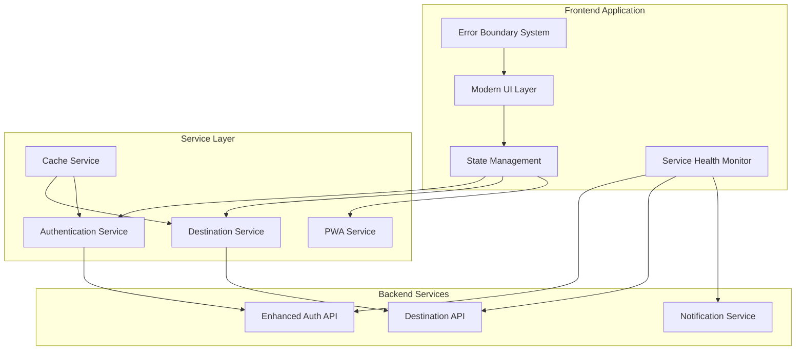

# Frontend User Experience Fixes - Design Document

## Overview

This design document outlines a comprehensive solution to address critical frontend user experience issues while elevating the travel platform to market-leading standards comparable to Wanderlog. The solution focuses on fixing authentication state management, PWA functionality, destination suggestions, and implementing modern UI/UX patterns that create an engaging, intuitive user experience.

The design emphasizes behavioral design principles, component-driven architecture, and progressive enhancement to ensure reliability across all user scenarios while providing a premium feel that encourages user engagement and retention.

## Architecture

### High-Level System Architecture



### Component Architecture

The system follows atomic design principles with a component hierarchy:

- **Atoms**: Basic UI elements (buttons, inputs, icons)
- **Molecules**: Simple component combinations (search bars, cards)
- **Organisms**: Complex UI sections (navigation, trip planners)
- **Templates**: Page layouts and structures
- **Pages**: Complete user interfaces

## Components and Interfaces

### 1. PWA Management System

#### PWAManager Interface
```typescript
interface PWAManager {
  // Event handling
  captureInstallPrompt(event: BeforeInstallPromptEvent): void;
  showInstallBanner(): void;
  hideInstallBanner(): void;
  
  // Installation flow
  promptInstallation(): Promise<InstallationResult>;
  handleInstallationResult(result: InstallationResult): void;
  
  // State management
  getInstallationState(): InstallationState;
  updateInstallationState(state: InstallationState): void;
}

interface InstallationState {
  canInstall: boolean;
  isInstalled: boolean;
  userDismissed: boolean;
  lastPromptTime: Date | null;
}
```

#### InstallBanner Component
- Modern card-based design with subtle animations
- Clear value proposition and installation benefits
- Smooth slide-in/slide-out transitions
- Respect user preferences and dismissal choices

### 2. Enhanced Authentication State Management

#### AuthenticationStateManager Interface
```typescript
interface AuthenticationStateManager {
  // State restoration
  restoreAuthenticationState(): Promise<AuthState>;
  persistAuthenticationState(state: AuthState): void;
  
  // Token management
  refreshTokens(): Promise<TokenRefreshResult>;
  handleTokenExpiration(): void;
  
  // Error handling
  handleAuthenticationError(error: AuthError): void;
  clearAuthenticationState(): void;
  
  // Integration
  syncWithEnhancedAuth(): Promise<void>;
}

interface AuthState {
  isAuthenticated: boolean;
  user: User | null;
  tokens: TokenPair | null;
  lastActivity: Date;
  requiresPasswordChange: boolean;
}
```

#### Authentication Flow Integration
- Seamless integration with existing enhanced authentication system
- Automatic token refresh with exponential backoff
- Graceful degradation when authentication services are unavailable
- Consistent error handling across all authentication methods

### 3. Destination Suggestions Recovery System

#### DestinationService Interface
```typescript
interface DestinationService {
  // Core functionality
  getDestinationSuggestions(query: string): Promise<Destination[]>;
  getCachedSuggestions(): Destination[];
  
  // Recovery mechanisms
  retryWithBackoff(operation: () => Promise<any>): Promise<any>;
  fallbackToCache(): Destination[];
  enableManualEntry(): void;
  
  // Health monitoring
  checkServiceHealth(): Promise<ServiceHealth>;
  handleServiceOutage(): void;
}

interface Destination {
  id: string;
  name: string;
  description: string;
  imageUrl: string;
  rating: number;
  category: string;
  coordinates: Coordinates;
}
```

#### Recovery Strategies
1. **Exponential Backoff Retry**: Automatic retry with increasing delays
2. **Cache Fallback**: Use previously cached suggestions when service unavailable
3. **Manual Entry Mode**: Allow users to manually enter destinations
4. **Progressive Loading**: Load suggestions incrementally as service recovers

### 4. Modern UI Component System

#### Design System Foundation
```typescript
interface DesignSystem {
  // Typography
  typography: {
    headings: TypographyScale;
    body: TypographyScale;
    captions: TypographyScale;
  };
  
  // Color palette
  colors: {
    primary: ColorPalette;
    secondary: ColorPalette;
    neutral: ColorPalette;
    semantic: SemanticColors;
  };
  
  // Spacing and layout
  spacing: SpacingScale;
  breakpoints: Breakpoints;
  
  // Animation system
  animations: AnimationTokens;
}
```

#### Card-Based Layout System
- **TravelCard Component**: Consistent card design for destinations, trips, and activities
- **CardGrid Component**: Responsive grid system with masonry layout support
- **CardCarousel Component**: Horizontal scrolling with smooth momentum
- **InteractiveCard Component**: Hover effects, micro-interactions, and state changes

#### Animation and Micro-Interaction System
```typescript
interface AnimationSystem {
  // Transition presets
  transitions: {
    fast: string;      // 150ms for immediate feedback
    normal: string;    // 300ms for standard interactions
    slow: string;      // 500ms for complex state changes
  };
  
  // Easing functions
  easing: {
    easeOut: string;
    easeInOut: string;
    spring: string;
  };
  
  // Micro-interactions
  microInteractions: {
    buttonPress: Animation;
    cardHover: Animation;
    loadingStates: Animation;
    successFeedback: Animation;
  };
}
```

### 5. Error Handling and User Feedback System

#### ErrorBoundary Component
```typescript
interface ErrorBoundary {
  // Error capture
  componentDidCatch(error: Error, errorInfo: ErrorInfo): void;
  
  // Recovery mechanisms
  retry(): void;
  fallbackToSafeState(): void;
  
  // User communication
  displayUserFriendlyMessage(error: Error): string;
  provideRecoveryOptions(error: Error): RecoveryOption[];
}

interface RecoveryOption {
  label: string;
  action: () => void;
  isPrimary: boolean;
}
```

#### Toast Notification System
- **Success States**: Subtle green notifications with checkmark animations
- **Error States**: Clear red notifications with retry options
- **Loading States**: Skeleton screens and progress indicators
- **Offline States**: Distinctive offline badges and sync status

### 7. Form Handling and Validation System

#### FormHandler Interface
```typescript
interface FormHandler {
  // Form submission
  submitForm(formData: FormData, endpoint: string): Promise<SubmissionResult>;
  validateForm(formData: FormData, schema: ValidationSchema): ValidationResult;
  
  // State management
  setSubmissionState(state: SubmissionState): void;
  getSubmissionState(): SubmissionState;
  
  // Error handling
  handleSubmissionError(error: SubmissionError): void;
  displayFieldErrors(errors: FieldError[]): void;
  
  // User feedback
  showLoadingState(): void;
  showSuccessState(result: SubmissionResult): void;
  showErrorState(error: SubmissionError): void;
}

interface SubmissionState {
  isSubmitting: boolean;
  hasErrors: boolean;
  fieldErrors: Record<string, string>;
  lastSubmission: Date | null;
}

interface ValidationSchema {
  fields: Record<string, FieldValidation>;
  customValidators?: CustomValidator[];
}

interface FieldValidation {
  required: boolean;
  type: 'text' | 'email' | 'date' | 'number' | 'select';
  minLength?: number;
  maxLength?: number;
  pattern?: RegExp;
  customValidator?: (value: any) => ValidationError | null;
}
```

#### TripCreationForm Component
- Real-time field validation with immediate feedback
- Proper form state management to prevent duplicate submissions
- Clear error messaging for both field-level and form-level errors
- Loading states with disabled submit button during processing
- Success confirmation with redirect or modal feedback

#### Form Validation Strategy
1. **Client-Side Validation**: Immediate feedback for user experience
2. **Server-Side Validation**: Security and data integrity
3. **Progressive Enhancement**: Form works without JavaScript
4. **Accessibility**: Screen reader compatible error messages

### 8. Service Health Monitoring

### 8. Service Health Monitoring

#### HealthMonitor Interface
```typescript
interface HealthMonitor {
  // Service monitoring
  monitorServices(): void;
  checkServiceHealth(service: string): Promise<HealthStatus>;
  
  // Status management
  updateServiceStatus(service: string, status: HealthStatus): void;
  getOverallHealth(): SystemHealth;
  
  // User communication
  notifyServiceChanges(changes: ServiceChange[]): void;
  enableOfflineMode(): void;
  disableOfflineMode(): void;
}

interface HealthStatus {
  isHealthy: boolean;
  responseTime: number;
  lastChecked: Date;
  errorCount: number;
}
```

## Data Models

### User Interface State
```typescript
interface UIState {
  // Theme and preferences
  theme: 'light' | 'dark' | 'auto';
  language: string;
  reducedMotion: boolean;
  
  // Layout state
  sidebarCollapsed: boolean;
  activeView: string;
  
  // Loading states
  loadingStates: Record<string, boolean>;
  
  // Error states
  errors: Record<string, UIError>;
}

interface UIError {
  message: string;
  type: 'warning' | 'error' | 'info';
  recoverable: boolean;
  timestamp: Date;
}
```

### Service Configuration
```typescript
interface ServiceConfig {
  // Retry configuration
  maxRetries: number;
  retryDelay: number;
  backoffMultiplier: number;
  
  // Cache configuration
  cacheTimeout: number;
  maxCacheSize: number;
  
  // Health check configuration
  healthCheckInterval: number;
  healthCheckTimeout: number;
}
```

## Correctness Properties

*A property is a characteristic or behavior that should hold true across all valid executions of a system—essentially, a formal statement about what the system should do. Properties serve as the bridge between human-readable specifications and machine-verifiable correctness guarantees.*

### PWA Management Properties

**Property 1: PWA Event Capture**
*For any* beforeinstallprompt event, the PWA Manager should capture and store the event for later use
**Validates: Requirements 1.1**

**Property 2: Install Banner Display**
*For any* user meeting installation criteria, the Install Banner should display with clear installation instructions
**Validates: Requirements 1.2**

**Property 3: Installation Prompt Invocation**
*For any* user clicking the install button, the PWA Manager should call the stored event's prompt() method
**Validates: Requirements 1.3**

**Property 4: Installation Success Handling**
*For any* successful installation, the PWA Manager should hide the install banner and update the installation state
**Validates: Requirements 1.4**

**Property 5: Installation Decline Respect**
*For any* declined installation, the PWA Manager should respect the user's choice and not show the banner again for the session
**Validates: Requirements 1.5**

### Authentication State Properties

**Property 6: Authentication State Restoration**
*For any* application load with valid stored tokens, the Authentication State should be restored properly
**Validates: Requirements 2.1**

**Property 7: Authentication Persistence**
*For any* authenticated user, the Authentication State should persist across page refreshes and browser sessions
**Validates: Requirements 2.2**

**Property 8: Token Refresh Attempt**
*For any* expired authentication tokens, the Authentication State should automatically attempt token refresh before showing errors
**Validates: Requirements 2.3**

**Property 9: Failed Refresh Cleanup**
*For any* failed token refresh, the Authentication State should clear the session and redirect to login
**Validates: Requirements 2.4**

**Property 10: 401 Response Handling**
*For any* API call receiving 401 responses, the Authentication State should handle them gracefully and update the UI accordingly
**Validates: Requirements 2.5**

### Destination Service Properties

**Property 11: Exponential Backoff Retry**
*For any* failed destination suggestion request, the Destination Service should retry with exponential backoff
**Validates: Requirements 3.1**

**Property 12: Helpful Error Messages**
*For any* unavailable destination suggestions, the Destination Service should display helpful error messages with retry options
**Validates: Requirements 3.2**

**Property 13: Cache Fallback**
*For any* unreachable backend service, the Destination Service should fall back to cached suggestions if available
**Validates: Requirements 3.3**

**Property 14: Manual Entry Fallback**
*For any* scenario with no cached data, the Destination Service should provide manual destination entry options
**Validates: Requirements 3.4**

**Property 15: Recovery UI Updates**
*For any* successful suggestion loading after failure, the Destination Service should update the UI immediately
**Validates: Requirements 3.5**

### Error Handling Properties

**Property 16: JavaScript Error Boundary**
*For any* JavaScript error, the Error Boundary should catch it and display a user-friendly error message
**Validates: Requirements 4.1**

**Property 17: API Error Classification**
*For any* failed API call, the Error Handler should provide specific error messages based on the failure type
**Validates: Requirements 4.2**

**Property 18: Network Connectivity Detection**
*For any* network connectivity issue, the Error Handler should detect and inform users about offline status
**Validates: Requirements 4.3**

**Property 19: Recoverable Error Options**
*For any* recoverable error, the Error Handler should provide clear retry or resolution options
**Validates: Requirements 4.4**

**Property 20: Secure Error Logging**
*For any* logged error, the Error Handler should include sufficient context for debugging without exposing sensitive data
**Validates: Requirements 4.5**

### Service Health Monitoring Properties

**Property 21: Service Outage Detection**
*For any* unreachable backend service, the Health Monitor should detect the outage and update service status
**Validates: Requirements 5.1**

**Property 22: Service Recovery Re-enablement**
*For any* recovered service, the Health Monitor should automatically re-enable affected features
**Validates: Requirements 5.2**

**Property 23: Selective Feature Disabling**
*For any* partial service outage, the Health Monitor should disable only affected features while keeping others functional
**Validates: Requirements 5.3**

**Property 24: Status Change Notifications**
*For any* service status change, the Health Monitor should notify users about availability changes
**Validates: Requirements 5.4**

**Property 25: Offline Mode Management**
*For any* offline mode activation, the Health Monitor should enable offline-capable features and disable network-dependent ones
**Validates: Requirements 5.5**

### Authentication Integration Properties

**Property 26: Enhanced Auth State Handling**
*For any* enhanced authentication system usage, the Auth Integration should properly handle all authentication states
**Validates: Requirements 6.1**

**Property 27: Password Change Workflow Triggering**
*For any* required password change, the Auth Integration should trigger the appropriate modals and workflows
**Validates: Requirements 6.2**

**Property 28: Auth Store Coordination**
*For any* session management operation, the Auth Integration should coordinate between enhanced auth and existing auth stores
**Validates: Requirements 6.3**

**Property 29: Consistent Auth Error Handling**
*For any* authentication error across different auth methods, the Auth Integration should provide consistent error handling
**Validates: Requirements 6.4**

**Property 30: Complete Logout Cleanup**
*For any* user logout, the Auth Integration should properly clear all authentication state and redirect appropriately
**Validates: Requirements 6.5**

### UI System Properties

**Property 31: Interactive Feedback Consistency**
*For any* user interaction with interface elements, the UI System should provide smooth animations, visual feedback, and micro-interactions that feel responsive and polished
**Validates: Requirements 7.1, 7.3, 7.6, 7.8**

**Property 32: Design System Consistency**
*For any* content display (travel content, destination information, general information), the UI System should use consistent modern layouts, typography, color schemes, iconography, and visual hierarchy
**Validates: Requirements 7.2, 7.4, 7.9**

**Property 33: Touch Optimization**
*For any* mobile device usage, the UI System should provide touch-optimized interactions with appropriate sizing and spacing
**Validates: Requirements 7.5**

**Property 34: Empty State Guidance**
*For any* empty state encounter, the UI System should provide helpful illustrations and clear calls-to-action to guide next steps
**Validates: Requirements 7.7**

**Property 35: Form Validation Feedback**
*For any* form interaction, the UI System should provide real-time validation with clear error states and success feedback
**Validates: Requirements 7.10**

### Responsive System Properties

**Property 36: Device Adaptation**
*For any* device type (mobile, tablet, desktop), the Responsive System should adapt layouts to provide optimal interaction and utilize available screen space efficiently
**Validates: Requirements 8.1, 8.2, 8.3**

**Property 37: Orientation Adaptation**
*For any* screen orientation change, the Responsive System should adapt layouts smoothly without losing user context
**Validates: Requirements 8.4**

**Property 38: Cross-Browser Consistency**
*For any* modern browser usage, the Responsive System should maintain consistent appearance and functionality
**Validates: Requirements 8.5**

### Form Handling Properties

**Property 44: Valid Form Submission Processing**
*For any* valid form data submitted to the Create Trip form, the Form Handler should process the submission and create the trip successfully
**Validates: Requirements 9.1**

**Property 45: Form Validation Feedback**
*For any* Create Trip button click, the Form Handler should validate all required fields and provide immediate feedback
**Validates: Requirements 9.2**

**Property 46: Validation Error Prevention**
*For any* form with validation failures, the Form Handler should highlight specific field errors and prevent submission until resolved
**Validates: Requirements 9.3**

**Property 47: Submission State Management**
*For any* form submission in progress, the Form Handler should disable the submit button and show loading state to prevent duplicate submissions
**Validates: Requirements 9.4**

**Property 48: Success Response Handling**
*For any* successful form submission, the Form Handler should redirect the user to the newly created trip or show success confirmation
**Validates: Requirements 9.5**

**Property 49: Server Error Recovery**
*For any* form submission failing due to server errors, the Form Handler should display clear error messages and allow retry
**Validates: Requirements 9.6**

**Property 50: Real-time Field Validation**
*For any* user interaction with form fields, the Form Handler should provide real-time validation feedback and clear error states
**Validates: Requirements 9.7**

### Performance and Accessibility Properties

**Property 51: Core Web Vitals Compliance**
*For any* page load, the Performance System should achieve Core Web Vitals scores that meet Google's "Good" thresholds
**Validates: Requirements 10.1**

**Property 52: Image Optimization**
*For any* image display, the Performance System should use optimized formats and lazy loading to minimize load times
**Validates: Requirements 10.2**

**Property 53: Progressive Enhancement**
*For any* slow connection scenario, the Performance System should prioritize critical content and provide progressive enhancement
**Validates: Requirements 10.3**

**Property 54: Assistive Technology Support**
*For any* assistive technology usage, the Accessibility System should provide proper ARIA labels, keyboard navigation, and screen reader support
**Validates: Requirements 10.4**

**Property 55: Motion Preference Respect**
*For any* user with reduced motion preferences, the Accessibility System should respect their preferences and minimize animations
**Validates: Requirements 10.5**

<function_calls>
<invoke name="prework">
<parameter name="featureName">frontend-ux-fixes

## Error Handling

### Error Classification System

The error handling system categorizes errors into distinct types for appropriate response:

1. **Network Errors**: Connection timeouts, DNS failures, server unavailability
2. **Authentication Errors**: Token expiration, invalid credentials, permission denied
3. **Validation Errors**: Form validation failures, data format errors
4. **Application Errors**: JavaScript runtime errors, component failures
5. **Service Errors**: Backend API errors, third-party service failures

### Error Recovery Strategies

#### Automatic Recovery
- **Token Refresh**: Automatic retry with refreshed authentication tokens
- **Exponential Backoff**: Progressive retry delays for transient failures
- **Cache Fallback**: Use cached data when services are unavailable
- **Graceful Degradation**: Disable affected features while maintaining core functionality

#### User-Initiated Recovery
- **Retry Buttons**: Clear retry options for recoverable errors
- **Manual Entry**: Alternative input methods when automated systems fail
- **Refresh Prompts**: Guided refresh instructions for state recovery
- **Support Links**: Direct access to help resources for complex issues

### Error Communication

#### User-Friendly Messages
- **Clear Language**: Avoid technical jargon in user-facing error messages
- **Actionable Guidance**: Provide specific steps users can take to resolve issues
- **Context Awareness**: Tailor messages based on user's current task and state
- **Emotional Tone**: Maintain helpful, reassuring tone even during failures

#### Developer Information
- **Detailed Logging**: Comprehensive error context for debugging
- **Stack Traces**: Full error traces in development environments
- **Performance Metrics**: Error frequency and impact measurements
- **User Journey Context**: Track user actions leading to errors

## Testing Strategy

### Dual Testing Approach

The testing strategy employs both unit testing and property-based testing to ensure comprehensive coverage:

#### Unit Testing Focus
- **Component Behavior**: Test specific UI component interactions and state changes
- **Error Scenarios**: Verify proper handling of known error conditions
- **Integration Points**: Test connections between services and components
- **Edge Cases**: Validate behavior at system boundaries and limits

#### Property-Based Testing Focus
- **Universal Properties**: Verify correctness properties hold across all valid inputs
- **State Transitions**: Test all possible state changes maintain system invariants
- **User Interactions**: Validate UI behavior across diverse interaction patterns
- **Service Integration**: Ensure consistent behavior across service communication patterns

### Testing Configuration

#### Property-Based Test Setup
- **Testing Library**: Jest with fast-check for property-based testing
- **Minimum Iterations**: 100 test cases per property to ensure statistical confidence
- **Test Tagging**: Each property test tagged with format: **Feature: frontend-ux-fixes, Property {number}: {property_text}**
- **Generators**: Smart input generators that produce realistic user scenarios and edge cases

#### Test Categories

**PWA Testing**
- Install prompt event simulation and capture verification
- Installation flow testing across different browsers and devices
- State persistence testing across browser sessions

**Authentication Testing**
- Token lifecycle testing with various expiration scenarios
- Multi-tab authentication state synchronization
- Enhanced authentication integration testing

**UI/UX Testing**
- Animation performance testing across devices
- Responsive layout testing on various screen sizes
- Accessibility compliance testing with assistive technologies

**Service Integration Testing**
- Network failure simulation and recovery testing
- Cache fallback mechanism validation
- Health monitoring accuracy verification

### Performance Testing

#### Core Web Vitals Monitoring
- **Largest Contentful Paint (LCP)**: Target < 2.5 seconds
- **First Input Delay (FID)**: Target < 100 milliseconds
- **Cumulative Layout Shift (CLS)**: Target < 0.1

#### Load Testing Scenarios
- **Slow Network Conditions**: 3G and slower connection simulation
- **High Latency**: Geographic distance simulation
- **Concurrent Users**: Multi-user interaction testing
- **Resource Constraints**: Limited memory and CPU testing

### Accessibility Testing

#### Automated Testing
- **ARIA Compliance**: Automated ARIA attribute validation
- **Color Contrast**: Automated contrast ratio verification
- **Keyboard Navigation**: Automated tab order and focus testing

#### Manual Testing
- **Screen Reader Testing**: NVDA, JAWS, and VoiceOver compatibility
- **Keyboard-Only Navigation**: Complete application navigation without mouse
- **Reduced Motion Testing**: Animation behavior with motion preferences disabled

This comprehensive testing strategy ensures that the frontend user experience fixes not only resolve current issues but also maintain high quality standards and prevent regression of existing functionality.