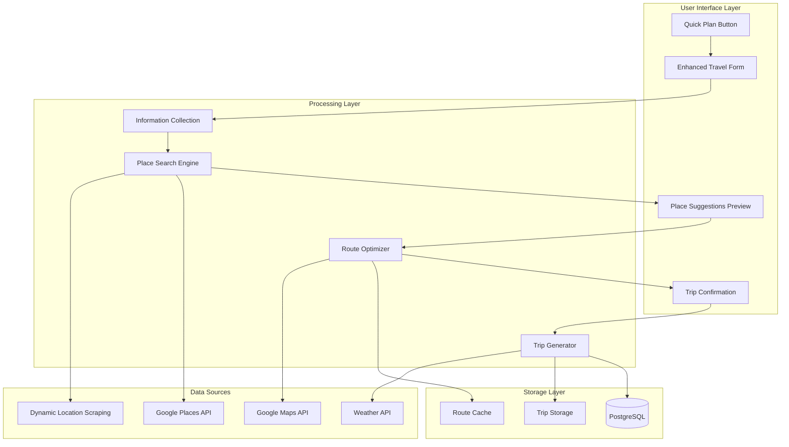

# Design Document

## Overview

The Quick Plan Enhancement transforms the existing Quick Plan feature into a comprehensive, intelligent trip creation system that provides users with a seamless experience from initial input to complete itinerary. The enhancement focuses on three core improvements: enhanced user experience with comprehensive travel information collection, intelligent place suggestion and route optimization using existing Dynamic Location Scraping infrastructure, and seamless trip creation workflow that eliminates manual save steps.

The system leverages the existing Journo platform architecture while introducing new components for route optimization, enhanced place filtering, and improved user interface flows. The design maintains compatibility with all existing features while significantly improving the user experience and trip quality.

## Architecture

### Enhanced Quick Plan Flow



### System Integration Points

The enhancement integrates with existing Journo systems:

1. **Dynamic Location Scraping Service**: Enhanced with interest-based filtering and budget considerations
2. **Route Calculation Service**: Extended with multi-point optimization and time-based scheduling
3. **Weather Service**: Integrated for weather-aware place suggestions and packing lists
4. **Trip Management**: Seamless creation of complete trips with all associated data
5. **Real-time Collaboration**: Generated trips support existing sharing and collaboration features

## Components and Interfaces

### Frontend Components

#### Enhanced QuickPlanModal Component

```typescript
interface EnhancedQuickPlanModalProps {
  isOpen: boolean;
  onClose: () => void;
  suggestedDestination?: string;
  onTripCreated?: (tripId: string) => void;
}

interface TravelInformation {
  destination: string;
  startDate: string;
  endDate: string;
  duration: number; // calculated automatically
  interests: InterestCategory[];
  budgetLevel: 'low' | 'medium' | 'high';
  travelStyle: 'relaxed' | 'moderate' | 'fast-paced';
  groupSize: number;
  travelerTypes: TravelerType[];
  mustVisitPlaces?: string[];
}

interface InterestCategory {
  id: string;
  name: string;
  icon: string;
  weight: number; // 1-5, affects suggestion priority
}

interface TravelerType {
  type: 'solo' | 'couple' | 'family' | 'friends' | 'business';
  ageGroups?: ('child' | 'teen' | 'adult' | 'senior')[];
}
```

#### PlaceSuggestionsPreview Component

```typescript
interface PlaceSuggestionsPreviewProps {
  suggestions: DailySuggestions[];
  travelInfo: TravelInformation;
  onRegenerateClick: () => void;
  onPlaceRemove: (dayIndex: number, placeIndex: number) => void;
  onPlaceReplace: (dayIndex: number, placeIndex: number) => void;
  onConfirmTrip: () => void;
  isGenerating: boolean;
}

interface DailySuggestions {
  dayNumber: number;
  date: string;
  weather?: WeatherInfo;
  places: SuggestedPlace[];
  totalTravelTime: number;
  estimatedCost: number;
}

interface SuggestedPlace {
  id: string;
  name: string;
  address: string;
  coordinates: { lat: number; lng: number };
  placeType: PlaceType;
  description: string;
  estimatedDuration: number; // minutes
  estimatedCost: number;
  rating?: number;
  tips?: string;
  openingHours?: string;
  travelTimeFromPrevious?: number;
  source: 'scraping' | 'google_places' | 'user_input';
}
```

### Backend Services

#### Enhanced QuickPlanService

```typescript
interface EnhancedQuickPlanRequest {
  destination: string;
  startDate: string;
  endDate: string;
  interests: InterestCategory[];
  budgetLevel: 'low' | 'medium' | 'high';
  travelStyle: 'relaxed' | 'moderate' | 'fast-paced';
  groupSize: number;
  travelerTypes: TravelerType[];
  mustVisitPlaces?: string[];
}

interface QuickPlanGenerationResult {
  suggestions: DailySuggestions[];
  weatherForecast: WeatherForecast;
  estimatedTotalCost: number;
  generationMetadata: {
    placesFound: number;
    routesOptimized: number;
    processingTime: number;
    dataSource: 'scraping' | 'fallback';
  };
}

class EnhancedQuickPlanService {
  async generateSuggestions(
    request: EnhancedQuickPlanRequest
  ): Promise<QuickPlanGenerationResult>;
  
  async createTripFromSuggestions(
    userId: string,
    suggestions: DailySuggestions[],
    travelInfo: TravelInformation
  ): Promise<{ tripId: string; success: boolean }>;
}
```

#### Enhanced LocationSearchService

```typescript
interface LocationSearchRequest {
  destination: string;
  interests: InterestCategory[];
  budgetLevel: 'low' | 'medium' | 'high';
  travelDates: { start: string; end: string };
  groupSize: number;
  travelerTypes: TravelerType[];
}

interface LocationSearchResult {
  places: EnrichedPlace[];
  searchMetadata: {
    totalFound: number;
    scrapingSources: string[];
    fallbackUsed: boolean;
    cacheHit: boolean;
  };
}

interface EnrichedPlace {
  // Base place data from scraping
  name: string;
  address: string;
  coordinates?: { lat: number; lng: number };
  rating?: number;
  tips?: string;
  
  // Enhanced data
  placeType: PlaceType;
  estimatedCost: number;
  estimatedDuration: number;
  budgetCategory: 'low' | 'medium' | 'high';
  interestMatch: number; // 0-1 score
  popularityScore: number;
  weatherSuitability: 'indoor' | 'outdoor' | 'flexible';
  openingHours?: OpeningHours;
  crowdLevel?: 'low' | 'medium' | 'high';
}
```

#### RouteOptimizationService

```typescript
interface RouteOptimizationRequest {
  places: SuggestedPlace[];
  startLocation?: { lat: number; lng: number };
  endLocation?: { lat: number; lng: number };
  travelStyle: 'relaxed' | 'moderate' | 'fast-paced';
  availableTime: number; // minutes per day
}

interface OptimizedRoute {
  orderedPlaces: SuggestedPlace[];
  totalTravelTime: number;
  totalDistance: number;
  routeSegments: RouteSegment[];
  optimizationScore: number; // 0-1, higher is better
}

interface RouteSegment {
  fromPlace: SuggestedPlace;
  toPlace: SuggestedPlace;
  travelMode: 'walking' | 'driving' | 'transit';
  duration: number;
  distance: number;
  polyline: string;
}

class RouteOptimizationService {
  async optimizeDailyRoute(
    request: RouteOptimizationRequest
  ): Promise<OptimizedRoute>;
  
  async optimizeMultiDayItinerary(
    dailyPlaces: SuggestedPlace[][],
    travelInfo: TravelInformation
  ): Promise<OptimizedRoute[]>;
}
```

## Data Models

### Enhanced Database Schema

```sql
-- Quick Plan Generation Sessions (for analytics and caching)
CREATE TABLE quick_plan_sessions (
  id UUID PRIMARY KEY DEFAULT uuid_generate_v4(),
  user_id UUID REFERENCES auth.users,
  destination TEXT NOT NULL,
  start_date DATE NOT NULL,
  end_date DATE NOT NULL,
  interests JSONB NOT NULL,
  budget_level TEXT CHECK (budget_level IN ('low', 'medium', 'high')),
  travel_style TEXT CHECK (travel_style IN ('relaxed', 'moderate', 'fast-paced')),
  group_size INT DEFAULT 1,
  traveler_types JSONB,
  places_generated INT DEFAULT 0,
  trip_created BOOLEAN DEFAULT FALSE,
  created_trip_id UUID REFERENCES trips,
  generation_time_ms INT,
  created_at TIMESTAMP DEFAULT NOW()
);

-- Place Suggestions Cache
CREATE TABLE place_suggestions_cache (
  id UUID PRIMARY KEY DEFAULT uuid_generate_v4(),
  destination_hash TEXT NOT NULL, -- Hash of destination + interests + budget
  suggestions_data JSONB NOT NULL,
  weather_data JSONB,
  cached_at TIMESTAMP DEFAULT NOW(),
  expires_at TIMESTAMP DEFAULT NOW() + INTERVAL '24 hours'
);

CREATE INDEX idx_place_suggestions_hash ON place_suggestions_cache(destination_hash);
CREATE INDEX idx_place_suggestions_expires ON place_suggestions_cache(expires_at);

-- Route Optimization Cache (extends existing route cache)
ALTER TABLE route_cache ADD COLUMN optimization_score DECIMAL(3,2);
ALTER TABLE route_cache ADD COLUMN travel_style TEXT;
ALTER TABLE route_cache ADD COLUMN place_count INT;

-- Enhanced Analytics Events
INSERT INTO analytics_event_types VALUES 
  ('quick_plan_started'),
  ('quick_plan_suggestions_generated'),
  ('quick_plan_suggestions_regenerated'),
  ('quick_plan_place_removed'),
  ('quick_plan_place_replaced'),
  ('quick_plan_trip_created'),
  ('quick_plan_abandoned');
```

### Data Flow Models

#### Place Suggestion Pipeline


#### Route Optimization Algorithm

```typescript
interface OptimizationAlgorithm {
  // 1. Cluster places by geographical proximity
  clusterPlaces(places: SuggestedPlace[]): PlaceCluster[];
  
  // 2. Solve Traveling Salesman Problem for each cluster
  optimizeClusterRoute(cluster: PlaceCluster): OptimizedRoute;
  
  // 3. Schedule places based on opening hours and visit duration
  schedulePlaces(route: OptimizedRoute, travelStyle: string): ScheduledRoute;
  
  // 4. Validate route feasibility (time constraints, travel modes)
  validateRoute(route: ScheduledRoute): ValidationResult;
}
```

## Error Handling

### Enhanced Error Scenarios

**Place Suggestion Failures**
- Strategy: Multi-tier fallback system (Scraping → Google Places → Curated defaults)
- User Experience: Show partial results with explanation of limitations
- Recovery: Offer alternative destinations or broader search criteria

**Route Optimization Failures**
- Strategy: Fallback to simple geographical ordering with time estimates
- User Experience: Display warning about non-optimized route with manual reorder option
- Recovery: Allow manual place reordering in preview

**Weather API Failures**
- Strategy: Use historical weather data or seasonal averages
- User Experience: Show "estimated weather" disclaimer
- Recovery: Generate generic packing list without weather-specific items

**Trip Creation Failures**
- Strategy: Save suggestions to localStorage for retry
- User Experience: Preserve all user input and suggestions
- Recovery: Retry with exponential backoff, offer manual trip creation

### Error Handling Implementation

```typescript
class QuickPlanErrorHandler {
  async handlePlaceSearchError(
    error: Error,
    request: LocationSearchRequest
  ): Promise<LocationSearchResult> {
    // Try fallback sources in order
    const fallbacks = [
      () => this.tryGooglePlaces(request),
      () => this.tryDefaultPlaces(request.destination),
      () => this.tryNearbyDestinations(request.destination)
    ];
    
    for (const fallback of fallbacks) {
      try {
        const result = await fallback();
        if (result.places.length > 0) {
          return { ...result, fallbackUsed: true };
        }
      } catch (fallbackError) {
        console.warn('Fallback failed:', fallbackError);
      }
    }
    
    throw new Error('No places found for destination');
  }
  
  async handleRouteOptimizationError(
    error: Error,
    places: SuggestedPlace[]
  ): Promise<OptimizedRoute> {
    // Fallback to simple geographical ordering
    const orderedPlaces = this.orderPlacesByProximity(places);
    const routeSegments = await this.calculateBasicRoutes(orderedPlaces);
    
    return {
      orderedPlaces,
      routeSegments,
      totalTravelTime: routeSegments.reduce((sum, seg) => sum + seg.duration, 0),
      totalDistance: routeSegments.reduce((sum, seg) => sum + seg.distance, 0),
      optimizationScore: 0.5, // Indicate non-optimized route
      fallbackUsed: true
    };
  }
}
```

## Testing Strategy

### Property-Based Testing Approach

Before writing correctness properties, I need to analyze the acceptance criteria for testability:

## Correctness Properties

*A property is a characteristic or behavior that should hold true across all valid executions of a system-essentially, a formal statement about what the system should do. Properties serve as the bridge between human-readable specifications and machine-verifiable correctness guarantees.*

### Property 1: Date Validation Consistency
*For any* start date and end date input, the system should validate that end date is after start date and calculate duration correctly
**Validates: Requirements 1.2**

### Property 2: Travel Style Place Distribution
*For any* travel style selection (relaxed, moderate, fast-paced), the system should generate appropriate numbers of places per day (3-4 for relaxed, 4-6 for moderate, 6-8 for fast-paced)
**Validates: Requirements 1.5, 7.1**

### Property 3: Group Size Recommendation Adaptation
*For any* group size and traveler type combination, the system should generate recommendations appropriate for that group configuration
**Validates: Requirements 1.6**

### Property 4: Suggestion Generation Completeness
*For any* valid travel information submission, the system should generate a preview containing suggested places organized by day with all required information
**Validates: Requirements 2.1, 2.2, 2.3, 4.6**

### Property 5: Input Preservation During Regeneration
*For any* regeneration request, the system should preserve all original user input while generating new place suggestions
**Validates: Requirements 2.5**

### Property 6: Interest-Based Query Construction
*For any* combination of destination and interests, the system should construct search queries that include interest-specific terms
**Validates: Requirements 3.2**

### Property 7: Place Ranking and Diversity
*For any* set of scraped places, the system should rank them by quality metrics and ensure diverse place types in the final selection
**Validates: Requirements 3.3, 3.4**

### Property 8: Budget-Consistent Filtering and Integration
*For any* budget level selection, the system should filter places within appropriate cost ranges and create matching budget tracking entries
**Validates: Requirements 3.5, 10.3**

### Property 9: Caching Behavior Consistency
*For any* repeated search request within 24 hours, the system should use cached results instead of making new external API calls
**Validates: Requirements 3.6**

### Property 10: Comprehensive Route Optimization
*For any* set of places, the system should calculate optimal routes that minimize travel time while considering opening hours, travel modes, and realistic scheduling
**Validates: Requirements 4.1, 4.2, 4.4, 4.7**

### Property 11: Geographical Clustering Logic
*For any* set of places in a destination, nearby places should be grouped together and scheduled on the same day
**Validates: Requirements 4.3**

### Property 12: Schedule Feasibility Validation
*For any* generated daily schedule, the total time including visits, travel, and buffers should not exceed reasonable daily limits
**Validates: Requirements 4.5, 7.4, 7.7**

### Property 13: Complete Trip Creation
*For any* approved suggestion set, the system should create a complete trip with all days, places, routes, weather, and packing list without requiring additional saves
**Validates: Requirements 5.2, 5.3, 5.4**

### Property 14: Theme Selection Logic
*For any* set of interests, the system should select the most appropriate trip theme based on the dominant interest category
**Validates: Requirements 5.5**

### Property 15: Weather-Appropriate Place Selection
*For any* weather conditions during travel dates, the system should prioritize places suitable for those conditions (indoor for rain, outdoor for sun, winter activities for cold)
**Validates: Requirements 6.2, 6.3, 6.4, 6.5, 6.6**

### Property 16: Time Allocation Accuracy
*For any* place type, the system should assign appropriate visit durations and ensure meal times are integrated into daily schedules
**Validates: Requirements 7.2, 7.3**

### Property 17: Opening Hours Compliance
*For any* place with known opening hours, the system should not schedule visits during closed times
**Validates: Requirements 7.5**

### Property 18: Activity Balance Optimization
*For any* daily schedule, the system should include a balanced mix of active and relaxed activities
**Validates: Requirements 7.6**

### Property 19: Customization Persistence
*For any* user customization (removed places, must-visit places), the system should remember these preferences during regeneration
**Validates: Requirements 9.1, 9.5, 9.6**

### Property 20: Alternative Suggestion Availability
*For any* generated suggestion, the system should provide alternative options that users can swap in
**Validates: Requirements 9.2, 9.7**

### Property 21: Place Count Adjustability
*For any* suggestion preview, users should be able to adjust the number of places per day and regenerate with the same parameters
**Validates: Requirements 9.3, 9.4**

### Property 22: System Compatibility Preservation
*For any* generated trip, all existing platform features (editing, collaboration, sharing, maps, exports) should work correctly
**Validates: Requirements 10.1, 10.2, 10.4, 10.6, 10.7**

### Property 23: Offline Support Consistency
*For any* generated trip, the system should cache all necessary data in localStorage for offline access
**Validates: Requirements 10.5**

## Testing Strategy

### Dual Testing Approach

The Quick Plan Enhancement will use both unit tests and property-based tests to ensure comprehensive coverage:

**Unit Tests** will focus on:
- Specific UI interactions and form validation
- Error handling scenarios and edge cases
- Integration points with external APIs
- Fallback behavior when services are unavailable

**Property-Based Tests** will focus on:
- Universal properties that hold across all inputs
- Algorithm correctness (route optimization, place ranking)
- Data consistency and business logic validation
- System behavior under various input combinations

### Property-Based Testing Configuration

- **Testing Framework**: Use fast-check for TypeScript property-based testing
- **Test Iterations**: Minimum 100 iterations per property test
- **Test Tagging**: Each property test tagged with format: **Feature: quick-plan-enhancement, Property {number}: {property_text}**
- **Coverage Requirements**: Each correctness property must be implemented by exactly one property-based test

### Key Testing Areas

**Algorithm Testing**:
- Route optimization algorithms with various place configurations
- Place ranking and filtering with different criteria combinations
- Schedule generation with various time constraints and preferences

**Integration Testing**:
- Dynamic Location Scraping service integration
- Google Maps API integration for route calculation
- Weather API integration for condition-based recommendations
- Database operations for trip creation and caching

**User Experience Testing**:
- Form validation with various input combinations
- Preview generation and customization workflows
- Error handling and recovery scenarios
- Performance under different load conditions

**Compatibility Testing**:
- Generated trips work with existing trip editing features
- Real-time collaboration functions correctly
- Export features (PDF, sharing, QR codes) work properly
- Offline functionality maintains data consistency

### Performance Testing

**Metrics to Track**:
- Place suggestion generation time < 5 seconds
- Route optimization completion time < 3 seconds
- Trip creation time < 2 seconds
- Cache hit rate > 80% for repeated searches

**Load Testing Scenarios**:
- Multiple concurrent quick plan generations
- Large destination databases with thousands of places
- Complex multi-day itineraries with many places
- Peak usage during travel planning seasons

## Security Considerations

### Input Validation and Sanitization

**Travel Information Validation**:
- Date range validation (start date before end date, reasonable future dates)
- Destination string sanitization to prevent injection attacks
- Interest selection validation against allowed categories
- Group size and traveler type validation within reasonable limits

**External API Security**:
- Rate limiting for Dynamic Location Scraping to prevent abuse
- API key protection for Google Maps and Weather services
- Input sanitization for search queries sent to external services
- Response validation from external APIs to prevent malicious data

### Data Privacy and Caching

**User Data Protection**:
- Travel preferences and search history encrypted in cache
- Automatic cache expiration to limit data retention
- User consent for storing travel preferences
- Option to clear all cached data and search history

**External Service Privacy**:
- Minimal data sharing with external APIs (only necessary location data)
- No personal information sent to scraping services
- Anonymized search queries where possible
- Compliance with external service privacy policies

### Authentication and Authorization

**Access Control**:
- Quick Plan feature requires user authentication
- Generated trips inherit user's ownership and permissions
- Collaboration features respect existing permission system
- Admin access required for cache management and analytics

**Session Security**:
- Secure token handling for authenticated requests
- Session timeout for inactive quick plan sessions
- CSRF protection for trip creation endpoints
- Rate limiting per user to prevent abuse

## Performance Optimization

### Caching Strategy

**Multi-Level Caching**:
1. **Browser Cache**: Store user preferences and recent searches in localStorage
2. **Application Cache**: Cache place suggestions and route calculations in Redis
3. **Database Cache**: Store processed place data and optimization results
4. **CDN Cache**: Cache static assets and common destination data

**Cache Invalidation**:
- Time-based expiration (24 hours for place data, 1 hour for routes)
- Event-based invalidation when underlying data changes
- User-triggered cache clearing for fresh results
- Automatic cleanup of expired cache entries

### Algorithm Optimization

**Place Search Optimization**:
- Parallel processing of multiple search queries
- Batch processing of Google Places API requests
- Intelligent query construction to reduce API calls
- Result deduplication to avoid processing duplicate places

**Route Optimization Performance**:
- Heuristic algorithms for large place sets (>20 places)
- Caching of route segments for reuse
- Parallel calculation of route alternatives
- Fallback to simpler algorithms for time-critical requests

### Database Performance

**Query Optimization**:
- Indexed searches on destination and interest combinations
- Materialized views for common place aggregations
- Connection pooling for concurrent requests
- Query result caching for repeated operations

**Data Structure Optimization**:
- JSONB indexing for flexible place data storage
- Spatial indexing for geographical queries
- Partitioning of large tables by date or region
- Compression of cached route and place data

## Deployment and Monitoring

### Deployment Strategy

**Incremental Rollout**:
1. **Feature Flag Controlled**: Deploy behind feature flag for gradual rollout
2. **A/B Testing**: Compare enhanced vs. original Quick Plan performance
3. **User Feedback Integration**: Collect and analyze user feedback during rollout
4. **Performance Monitoring**: Track system performance and user satisfaction

**Rollback Plan**:
- Immediate feature flag disable if critical issues arise
- Database migration rollback procedures
- Cache clearing and reset procedures
- User notification system for service disruptions

### Monitoring and Analytics

**System Health Monitoring**:
- Quick Plan generation success/failure rates
- Average generation time and performance metrics
- External API health and response times
- Cache hit rates and storage utilization

**User Experience Analytics**:
- Quick Plan usage patterns and completion rates
- Most popular destinations and interest combinations
- User customization and regeneration behavior
- Trip creation success rates from Quick Plan

**Business Intelligence**:
- Quick Plan conversion to actual trips
- User satisfaction scores and feedback analysis
- Feature adoption rates and usage trends
- Revenue impact from improved trip creation experience

## Future Enhancements

### Advanced Features

**Machine Learning Integration**:
- Personalized recommendations based on user history
- Predictive modeling for optimal trip timing
- Sentiment analysis of place reviews for better ranking
- Dynamic pricing predictions for budget optimization

**Enhanced Collaboration**:
- Group planning with multiple users contributing preferences
- Real-time collaborative editing of quick plan suggestions
- Voting system for group decision making on places
- Integration with calendar systems for group availability

**Smart Integrations**:
- Integration with booking platforms for seamless reservations
- Real-time availability checking for restaurants and attractions
- Dynamic pricing integration for budget-aware suggestions
- Social media integration for trending destination discovery

### Scalability Improvements

**Infrastructure Scaling**:
- Microservices architecture for independent scaling
- Distributed caching across multiple regions
- Load balancing for high-traffic periods
- Auto-scaling based on demand patterns

**Data Processing Enhancements**:
- Real-time place data updates from multiple sources
- Machine learning pipelines for continuous improvement
- Advanced analytics for pattern recognition
- Predictive caching based on usage patterns